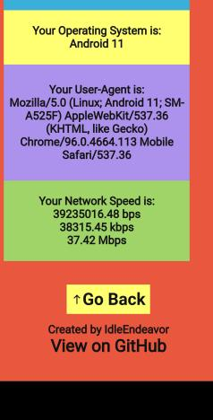

**Me Online** is a website that shows you what information you leak online and how websites see you. It uses WebRTC to fetch information such as your IP address, Browser, Screen Size etc. This ensures that your data is safe from being processed via Third-Party APIs or services and is only gathered from your device for display and storage only on your device.

### Screenshots

 

 

This Project was forked from [EsmailELBoBDev2/What-Is-My-IP-Address](https://github.com/EsmailELBoBDev2/What-Is-My-IP-Address)
